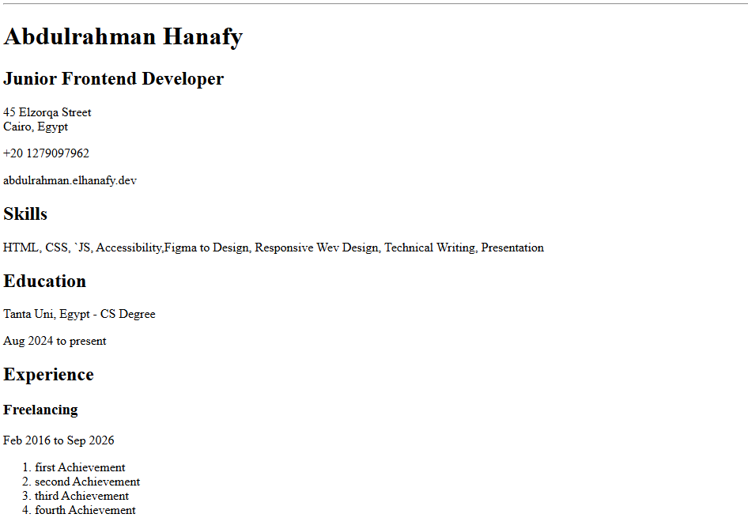

# Front-end Projects from Roadmap.sh

This repository contains front-end projects built following the [roadmap.sh](https://roadmap.sh/) front-end developer path.

## Projects List

[Single Page CV](https://roadmap.sh/projects/single-page-cv)

Click any of the images below to view the readme and live demo of the project.

  
  <!-- Future projects will be added here -->

<!-- Additional project rows will be added as more projects are completed -->

## Getting Started

Each project folder contains its own README with specific instructions. The projects are organized in order of completion from the roadmap.sh front-end path.

## Contributing

Feel free to explore the projects, provide feedback, or use them as references for your own front-end development journey!
